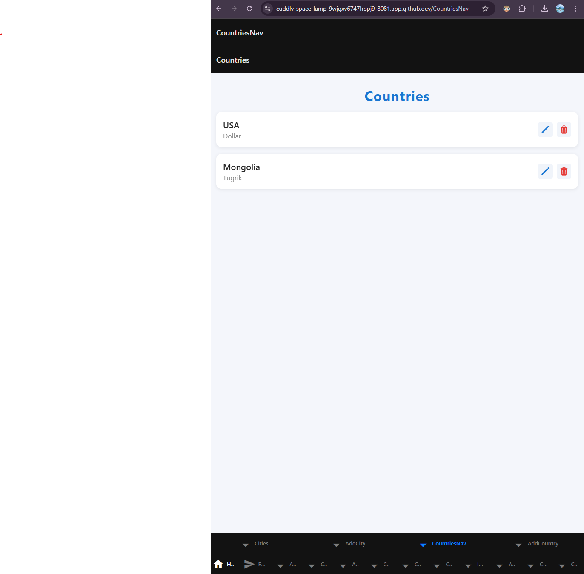

# PE06 – Cities with Countries and Currency using Tab and Stack-based Navigations

## Project Setup

To set up and run the project, follow these steps:

1. Create a new Expo app:
   ```bash
   npx create-expo-app Styling
   ```

2. Navigate to the project directory:
   ```bash
   cd Styling
   ```

3. Log in to Expo (if not already logged in):
   ```bash
   npx expo login
   ```

4. Start the development server:
   ```bash
   npx expo start --tunnel
   ```

---

## Input

- User enters a country name and its currency in the Add Country form.
- User can view, edit, or delete countries in the Countries list.

## Process

- When a country and currency are submitted, they are added to the countries list in the app state.
- The Countries tab uses stack-based navigation to show the list and details for each country.
- Editing or deleting a country updates the list in real time.

## Output

Below are screenshots of the Add Country form and the Countries list, shown side by side:

<p align="center">
  
  
</p>

---

This project demonstrates a professional React Native/Expo app for managing cities and countries with a modern UI/UX.


